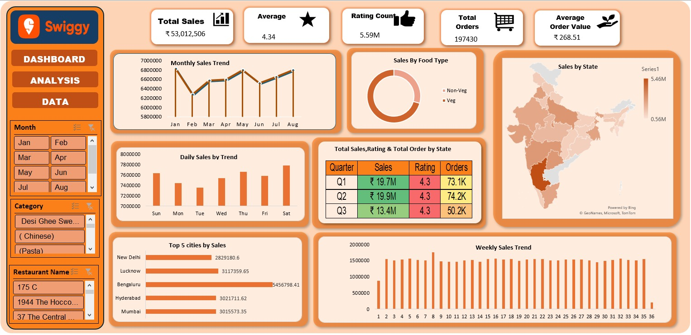

# 🍔 Swiggy Sales & Performance Dashboard (Excel Project)

## 📌 Project Overview
This project analyzes Swiggy food delivery data using Microsoft Excel to generate insights about sales performance, customer behavior, and restaurant trends.

## 🎯 Objective
- Analyze order patterns
- Identify top-performing restaurants
- Understand customer preferences
- Track revenue trends

## 🛠 Tools Used
- Microsoft Excel
- Pivot Tables
- Charts & Graphs
- Dashboard Design

## 📊 Key Insights
- Top restaurants contributing maximum revenue
- Most popular food categories
- Peak order times
- City-wise performance analysis

## 📁 Dataset
The dataset contains:
- Order details
- Restaurant names
- Categories
- Pricing
- Locations

## 📸 Dashboard Preview

## 🚀 Conclusion
This dashboard helps in understanding customer behavior and business performance, enabling better decision-making.

---
